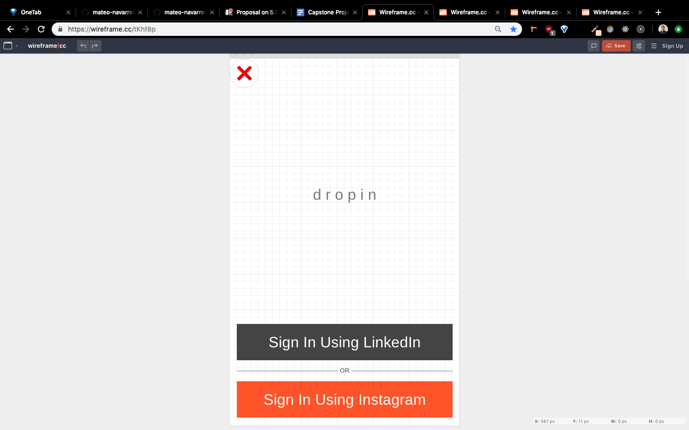
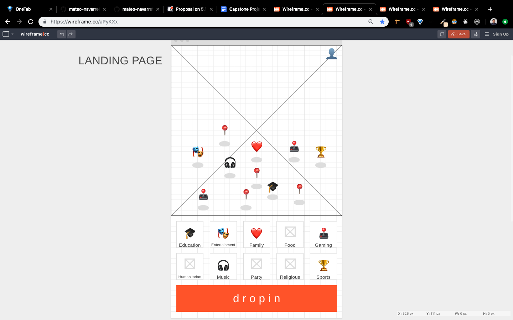
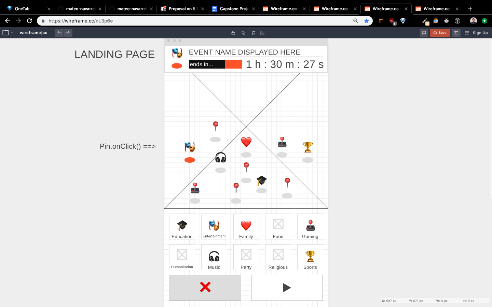
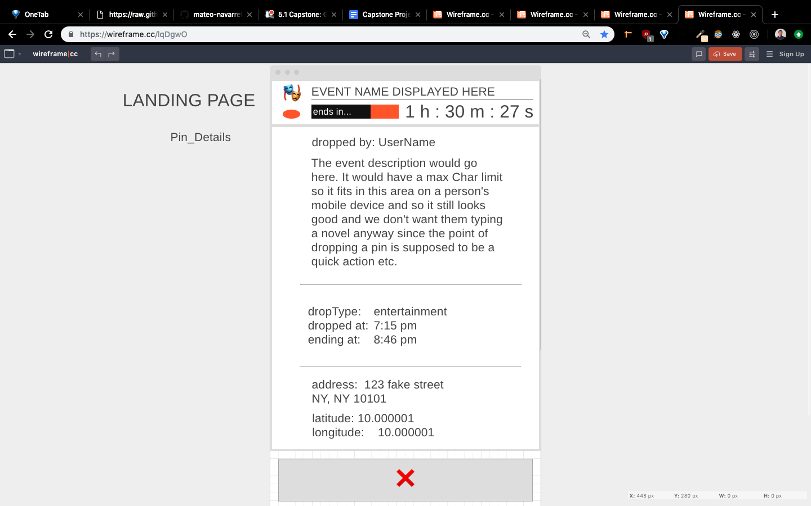
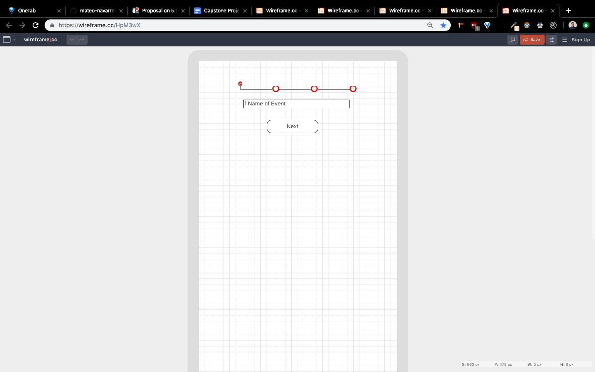
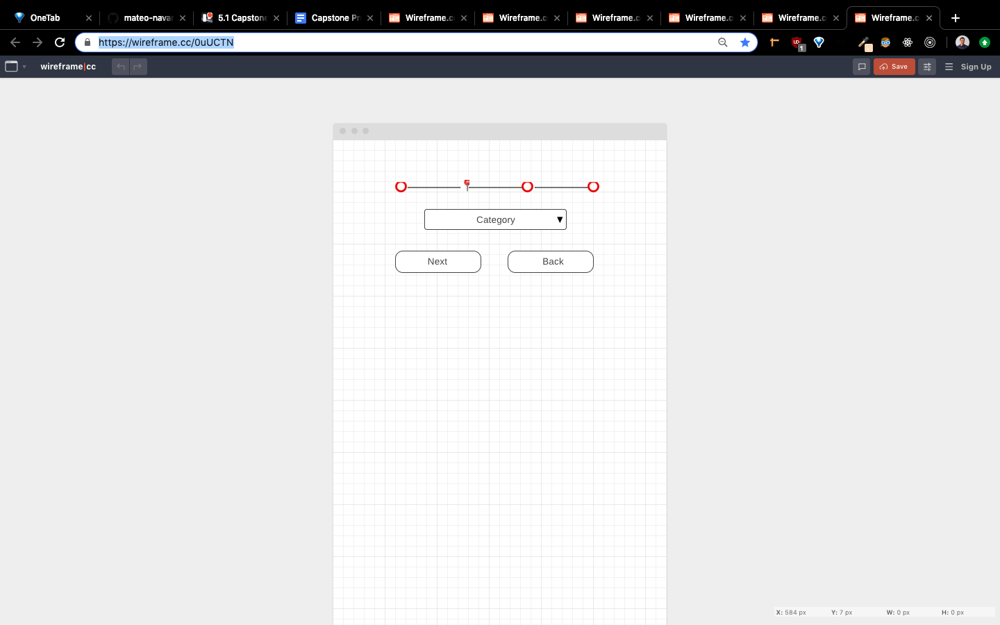
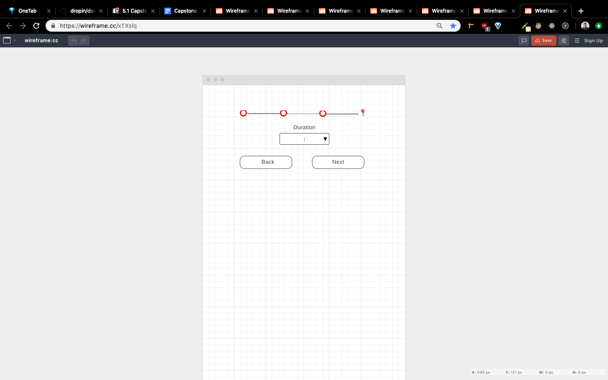

# v1_Wireframes

## 

TODO:  
FrontEnd Route URL: `/signin`  
BackEnd API Endpoint: `/users`  
State: `{ user, loggedIn }`  
Actions: `TBD`  
Components:

```
TBD
```

---

## 

TODO:  
FrontEnd Route URL: `/`  
BackEnd API Endpoint: `TBD`  
State: `{ user, loggedIn, drops, events }`  
Actions: `TBD`  
Components:

```
TBD
```

---

## 

TODO:  
FrontEnd Route URL: `/`  
BackEnd API Endpoint: `TBD`  
State: `{ dropType, name, duration, endTime, dropIcon, linkTo }`  
Actions: `TBD`  
Components:

```
TBD
```

---


## 

TODO:  
FrontEnd Route URL: `/events/`  
BackEnd API Endpoint: `/events/:id`  
State: `{ user, loggedIn }`  
Actions: `TBD`  
Components:

```
TBD
```

---

## 

TODO:  
FrontEnd Route URL: `/users/:id`  
BackEnd API Endpoint: `/events/:id`  
State: `{ user, loggedIn }`  
Actions: `TBD`  
Components:

```
TBD
```

---

## 

TODO:  
FrontEnd Route URL: `/users/:id`  
BackEnd API Endpoint: `/events/:id`  
State: `{ user, loggedIn }`  
Actions: `TBD`  
Components:

```
TBD
```

---

## 

TODO:  
FrontEnd Route URL: `/users/:id`  
BackEnd API Endpoint: `/events/:id`  
State: `{ user, loggedIn }`  
Actions: `TBD`  
Components:

```
TBD
```

---
